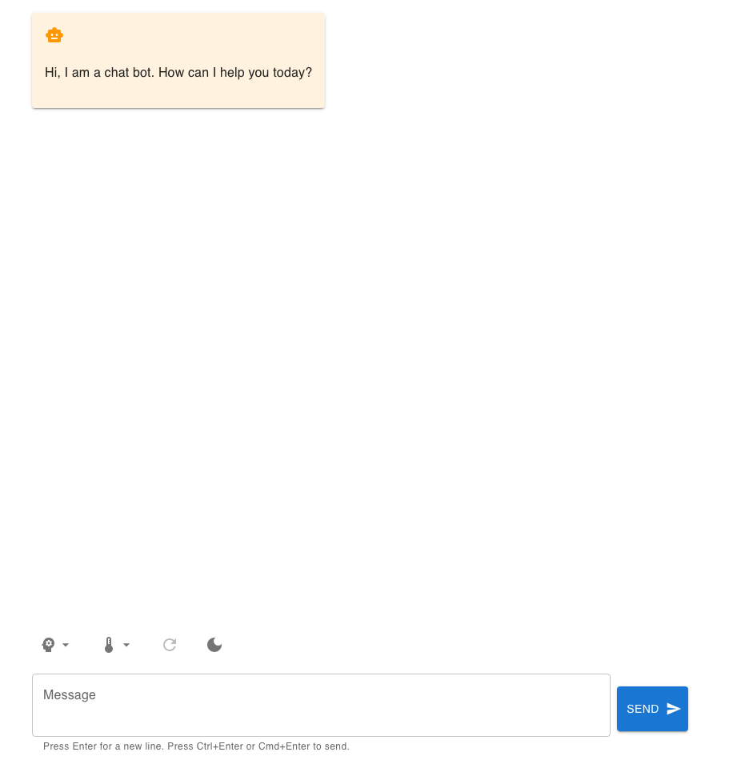
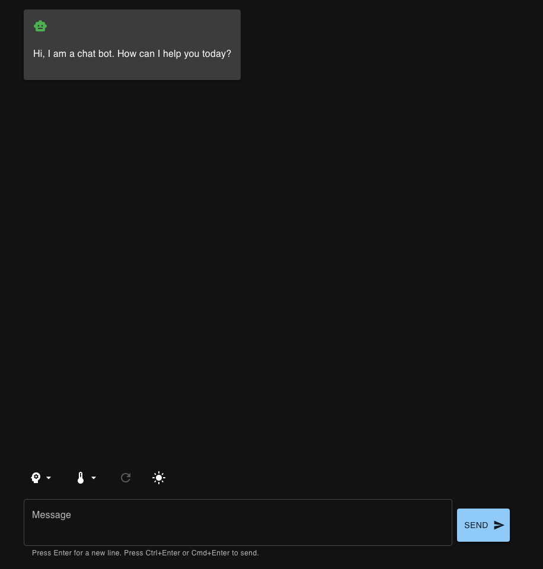

# Chatbot Template

A minimal full-stack chatbot template using React and FastAPI, backed by
Azure OpenAI GPT-4o and GPT-4o mini deployments.

## Interface Preview

| Light mode | Dark mode |
|------------|-----------|
|  |  |

## Architecture/Design

The project is structured as a monorepo with two services:

- `frontend`: A React application that allows users to interact with the
  configured Azure OpenAI model.
- `backend`: A FastAPI application that serves as the backend for the
  frontend application.

The frontend service is a Vite React application that uses the Vercel AI
SDK to manage chat state and streamed responses from the backend service.
The backend service is a FastAPI application that exposes a streaming
API backed by Azure OpenAI GPT-4o and GPT-4o mini deployments.

The UI is built with [Material
UI](https://mui.com/material-ui/getting-started/) components and follows
Google's Material Design.

Frontend interface work uses Vercel's [Web Interface
Guidelines](https://vercel.com/design/guidelines) as the review baseline for
new and changed UI. Treat those guidelines as the target for interaction
details such as keyboard operability, visible focus states, loading and error
states, reduced-motion support, resilient layout, semantic controls, and
concise action copy.

The project targets **WCAG 2.1 Level AA** compliance. Reviewers should test
against WCAG 2.1 AA success criteria across the four POUR principles
(Perceivable, Operable, Understandable, and Robust). Lighthouse CI enforces a
perfect score (100%) for accessibility, best-practices, and SEO, with
performance at ≥ 85% as a hard failure. A separate axe-powered contrast audit
checks WCAG AA colour contrast in both light and dark mode. Automated checks do
not cover every AA criterion, so manual verification is also required for new UI.

The app has also been reviewed against [The Website
Specification](https://specification.website/checklist/), a broad checklist of
web good practices. The relevant items — document foundations, security
response headers, nginx caching and compression, and PWA metadata — are
implemented in `frontend/index.html`, `frontend/frontend.nginx.conf`, and
`frontend/app/favicon/site.webmanifest`. The SEO, internationalisation, and
agent-readiness categories are intentionally out of scope for an internal
chatbot SPA. Deferred items to revisit if deployment changes: HSTS (depends on
where TLS terminates), and shipping fonts as WOFF2.

## Setup

- Clone the repository
- Create `backend/.env` file (cf. `backend/.env.example`)
- Restore needed dependencies:

``` bash
# backend
cd backend
uv sync --frozen

# frontend
cd frontend
pnpm install --frozen-lockfile
```

- Run the services:

``` bash
docker-compose up
```

The browser talks to the frontend on the same origin at `/api/v1/chat`. In
Docker Compose, the frontend container proxies that path to the backend
container, so the backend host is not exposed to browser code or the network
tab.

The frontend Docker build is multi-stage: the builder stage installs
`devDependencies` so it can run `vite build`, while the final runtime image is
nginx-only and does not ship the frontend `node_modules` tree or dev tooling.

For local Vite development against a non-default backend, set the server-side
proxy target before starting the frontend dev server:

``` bash
CHAT_API_PROXY_TARGET=https://example.com pnpm run dev
```

- The frontend service is available at `http://localhost:3000`
- The backend service is available at `http://localhost:8000`

REST API can be interactively explored using FastAPI's Swagger UI:
`http://localhost:8000/docs`

## Runtime Versions

| Runtime / tool | Version source | Current version |
|----------------|----------------|-----------------|
| Python         | `backend/.python-version` / `backend/pyproject.toml` | 3.14 |
| uv             | `backend/pyproject.toml` / `backend/Dockerfile` | 0.11.28 |
| Node.js        | `frontend/.nvmrc` / frontend Docker image | 24 |
| pnpm           | `frontend/package.json` / CI workflows | 11.9.0 |

## Quality Assurance

### Automated checks

The frontend and backend services have their own quality checks.
All checks can be run locally with:

``` bash
make qa
```

To refresh backend/frontend dependencies and `prek` hook revisions locally:

``` bash
make update-deps
```

To validate Lighthouse scores against thresholds locally:

``` bash
make lighthouse
```

Lighthouse runs three mobile-throttled samples and asserts the median result.
Performance, accessibility, best-practices, SEO, LCP, CLS, and TBT are all hard
failures. Lighthouse reports must not contain unresolved `runWarnings` or
warn-only assertions.

To validate WCAG AA colour contrast in both UI themes:

``` bash
make contrast-audit
```

New UI changes should still be reviewed against the Vercel Web Interface
Guidelines, because many interaction, content, and layout details require
manual judgment. The guidelines are an implementation target, not a blanket
claim that every existing screen is already fully compliant.

To remove all build artifacts and tool caches for a clean slate (useful
for testing cold-cache behaviour):

``` bash
make clean
```

More specifically:

| Step                      | Frontend                         | Backend                   |
|---------------------------|----------------------------------|---------------------------|
| Package manager           | pnpm                             | uv                        |
| Formatter                 | Biome                            | Ruff                      |
| Linter                    | Biome                            | Ruff                      |
| Import sorter             | Biome                            | Ruff                      |
| Type checker              | TypeScript                       | ty                        |
| Type annotation coverage  | type-coverage                    | typecoverage              |
| Security linting          | ESLint (`no-unsanitized`, `react-dom`) | \-                  |
| Dead-code / complexity    | fallow                           | \-                        |
| CSS code quality          | @projectwallace/css-code-quality | \-                        |
| Contrast audit            | axe-core (`color-contrast`) in light and dark mode | \- |
| Markdown linting          | rumdl                            | rumdl                     |
| File naming               | ls-lint                          | ls-lint                   |
| Pre-commit hooks          | prek                             | prek                      |
| Commit message linting    | commitlint                       | commitlint                |
| IaC / workflow scan       | Checkov                          | Checkov                   |
| Container vuln scan       | Trivy                            | Trivy                     |
| Unit testing              | Vitest                           | pytest                    |
| Property-based testing    | fast-check                       | Hypothesis                |
| Code coverage             | Vitest                           | coverage.py               |
| Coverage floor            | 90% statements/functions/lines; 75% branches | 100% |
| Load testing              | \-                               | locust                    |
| End-to-end testing        | Playwright                       | \-                        |
| Dependency audit          | pnpm audit                       | uv audit                  |
| Performance / a11y        | Lighthouse CI, axe-core          | \-                        |
| API client                | Vercel AI SDK                    | openai                    |
| API server                | \-                               | FastAPI                   |
| UI toolkit                | Material UI                      | \-                        |
| Logger                    | \-                               | loguru                    |

Commit messages are validated by the `commit-msg` prek hook with commitlint.
The config follows conventional commits and accepts both lowercase and
uppercase commit types, for example `feat: ...` and `FEAT: ...`.

Checkov scans the repository's Dockerfiles, Docker Compose/YAML files,
GitHub Actions workflows, and secrets surface. Local-only secrets in
`backend/.env` are excluded because that file is required for development
and must not be committed:

``` bash
make security-scan
```

The Checkov scan also runs on every push and pull request through the
dedicated GitHub Actions security workflow. Commitlint is enforced locally
through the `commit-msg` prek hook.

Trivy scans the built backend and frontend container images for known
vulnerabilities during CI.
