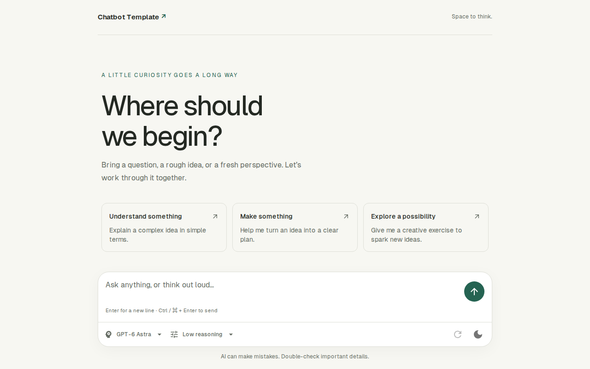
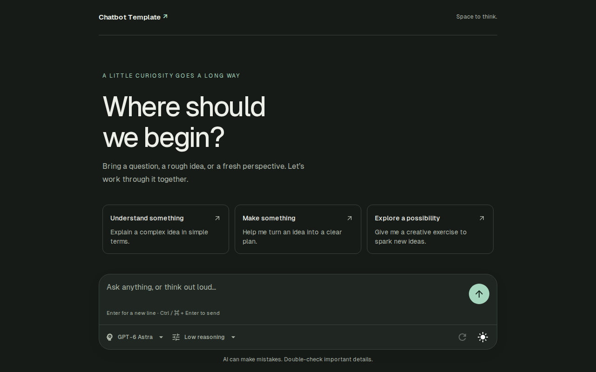

# Chatbot Template

A minimal full-stack chatbot template using React and FastAPI, backed by
Azure OpenAI GPT-6 Astra and GPT-5.6 Sol deployments.

## Interface Preview

| Light mode                                                                | Dark mode                                                               |
| ------------------------------------------------------------------------- | ----------------------------------------------------------------------- |
|  |  |

## Architecture/Design

The project is structured as a monorepo with two services:

- `frontend`: A React application that allows users to interact with the
  configured Azure OpenAI model.
- `backend`: A FastAPI application that serves as the backend for the
  frontend application.

The frontend service is a Vite React application that uses the Vercel AI
SDK to manage chat state and streamed responses from the backend service.
The backend service is a FastAPI application that exposes a streaming
API backed by Azure OpenAI GPT-6 Astra and GPT-5.6 Sol deployments.

The UI is built with [Material
UI](https://mui.com/material-ui/getting-started/) components and follows
Google's Material Design.

Frontend interface work uses Vercel's [Web Interface
Guidelines](https://vercel.com/design/guidelines) as the review baseline for
new and changed UI. Treat those guidelines as the target for interaction
details such as keyboard operability, visible focus states, loading and error
states, reduced-motion support, resilient layout, semantic controls, and
concise action copy.

The project targets **WCAG 2.1 Level AA** compliance. Reviewers should test
against WCAG 2.1 AA success criteria across the four POUR principles
(Perceivable, Operable, Understandable, and Robust). Lighthouse CI enforces a
perfect score (100%) for accessibility, best-practices, and SEO, with
performance at ≥ 85% as a hard failure. A separate axe-powered contrast audit
checks WCAG AA colour contrast in both light and dark mode. Automated checks do
not cover every AA criterion, so manual verification is also required for new UI.

The app has also been reviewed against [The Website
Specification](https://specification.website/checklist/), a broad checklist of
web good practices. The relevant items — document foundations, security
response headers, nginx caching and compression, and PWA metadata — are
implemented in `frontend/index.html`, `frontend/frontend.nginx.conf`, and
`frontend/app/favicon/site.webmanifest`. The SEO, internationalisation, and
agent-readiness categories are intentionally out of scope for an internal
chatbot SPA. Deferred items to revisit if deployment changes: HSTS (depends on
where TLS terminates), and shipping fonts as WOFF2.

## Setup

- Clone the repository
- Create `backend/.env` file (cf. `backend/.env.example`)
- Set the Azure Foundry resource endpoint and key. The resource must have
  deployments named `gpt-6-astra` and `gpt-5.6-sol`.
- The app defaults to GPT-6 Astra with low reasoning effort. The model picker
  also offers GPT-5.6 Sol; reasoning effort can be low, medium, or high.
  Requests use `reasoning_effort` instead of `temperature`, which GPT-6 Astra
  does not support.
- Restore needed dependencies:

``` bash
# backend
cd backend
uv sync --frozen

# frontend
cd frontend
pnpm install --frozen-lockfile
```

pnpm 12 reads the Node.js 24 runtime declaration from `package.json`. Package
scripts therefore use the project runtime automatically, even when a different
Node.js version is installed globally.

`make update-deps` also checks for registry-provided revisions of already locked
package versions, allowing patched artifacts to be adopted without changing the
declared dependency version.

- Run the services:

``` bash
docker-compose up
```

The browser talks to the frontend on the same origin at `/api/v1/chat`. In
Docker Compose, the frontend container proxies that path to the backend
container, so the backend host is not exposed to browser code or the network
tab.

The frontend Docker build is multi-stage: the builder stage installs
`devDependencies` so it can run `vite build`, while the final runtime image is
nginx-only and does not ship the frontend `node_modules` tree or dev tooling.

For local Vite development against a non-default backend, set the server-side
proxy target before starting the frontend dev server:

``` bash
CHAT_API_PROXY_TARGET=https://example.com pnpm run dev
```

- The frontend service is available at `http://localhost:3000`
- The backend service is available at `http://localhost:8000`

REST API can be interactively explored using FastAPI's Swagger UI:
`http://localhost:8000/docs`

## Runtime Versions

| Runtime / tool | Version source                                                      | Current version |
| -------------- | ------------------------------------------------------------------- | --------------- |
| Python         | `backend/.python-version` / `backend/pyproject.toml`                | 3.14            |
| uv             | `backend/pyproject.toml` / `backend/Dockerfile`                     | 0.12.12         |
| Node.js        | `frontend/package.json` / `frontend/.nvmrc` / frontend Docker image | 24              |
| pnpm           | `frontend/package.json` / CI workflows                              | 12.4.1          |

## Quality Assurance

### Automated checks

The frontend and backend services have their own quality checks.
All checks can be run locally with:

``` bash
make qa
```

To refresh backend/frontend dependencies and `prek` hook revisions locally:

``` bash
make update-deps
```

To validate Lighthouse scores against thresholds locally:

``` bash
make lighthouse
```

Lighthouse runs three mobile-throttled samples and asserts the median result.
Performance, accessibility, best-practices, SEO, LCP, CLS, and TBT are all hard
failures. Lighthouse reports must not contain unresolved `runWarnings` or
warn-only assertions.

To validate WCAG AA colour contrast in both UI themes:

``` bash
make contrast-audit
```

New UI changes should still be reviewed against the Vercel Web Interface
Guidelines, because many interaction, content, and layout details require
manual judgment. The guidelines are an implementation target, not a blanket
claim that every existing screen is already fully compliant.

### Browser and visual tests

Vitest checks data contracts and interactions with the existing coverage floors.
Playwright checks presentation with reviewed screenshots of the real app in light
and dark mode, at desktop and mobile sizes. API responses are mocked; no backend
or Azure credentials are needed.

``` bash
make test             # backend and frontend unit tests with coverage
make e2e-test         # build + local browser behavior; visuals skip off-Linux
make e2e-test-docker  # build + behavior + visual comparisons in the CI renderer
make e2e-update       # deliberately regenerate visual baselines
```

Use the Docker targets for visual comparisons and updates on every host. They
share a digest-pinned Playwright Linux/amd64 image with CI, including on Apple
Silicon, and keep Linux dependencies in a dedicated Docker volume. The production
preview uses port 3000 and refuses to reuse an existing server.
The container restores generated output ownership to your UID/GID on exit,
including after test failures, so native Linux builds and edits stay writable.

Snapshots cover the greeting, validation, model/reasoning menus, Markdown
conversation, pending response, and request failure. Screenshot assertions wait
for stable rendering with bundled fonts and disabled animations; ordinary test
runs fail on missing baselines and never update them automatically.

After an intentional UI change, run `make e2e-update` and inspect the changed PNGs
in `frontend/e2e-tests/__snapshots__/`. Run `make e2e-test-docker`, then commit
the reviewed baselines with the change. To focus a run, pass
`E2E_ARGS='visual.spec.ts --workers=1'` to either Docker target.
Failure diffs and traces are in `frontend/test-results/`; the HTML report is in
`frontend/playwright-report/`. CI uploads both as the `playwright-report` artifact.

`make qa` and `make qa-frontend` keep their unit-test coverage checks; the separate
browser CI job runs the same `make e2e-test-docker` target. When upgrading
`@playwright/test`, update the image tag and SHA256 digest in
`makefiles/frontend.mk` together and regenerate/review the baselines.

To remove all build artifacts and tool caches for a clean slate (useful
for testing cold-cache behaviour):

``` bash
make clean
```

More specifically:

| Step                     | Frontend                                           | Backend      |
| ------------------------ | -------------------------------------------------- | ------------ |
| Package manager          | pnpm                                               | uv           |
| Formatter                | Biome                                              | Ruff         |
| Linter                   | Biome                                              | Ruff         |
| Import sorter            | Biome                                              | Ruff         |
| Type checker             | TypeScript                                         | ty           |
| Type annotation coverage | type-coverage                                      | typecoverage |
| Security linting         | ESLint (`no-unsanitized`, `react-dom`)             | \-           |
| Codebase analysis        | Fallow                                             | \-           |
| CSS code quality         | @projectwallace/css-code-quality                   | \-           |
| Contrast audit           | axe-core (`color-contrast`) in light and dark mode | \-           |
| Markdown linting         | rumdl                                              | rumdl        |
| File naming              | ls-lint                                            | ls-lint      |
| Pre-commit hooks         | prek                                               | prek         |
| Commit message linting   | commitlint                                         | commitlint   |
| IaC / workflow scan      | Checkov                                            | Checkov      |
| Secret scanning          | Gitleaks                                           | Gitleaks     |
| GitHub Actions audit     | zizmor                                             | zizmor       |
| Container vuln scan      | Trivy                                              | Trivy        |
| Unit testing             | Vitest                                             | pytest       |
| Property-based testing   | fast-check                                         | Hypothesis   |
| Code coverage            | Vitest                                             | coverage.py  |
| Coverage floor           | 90% statements/functions/lines; 75% branches       | 100%         |
| Load testing             | \-                                                 | locust       |
| End-to-end testing       | Playwright                                         | \-           |
| Dependency audit         | pnpm audit                                         | uv audit     |
| Performance / a11y       | Lighthouse CI, axe-core                            | \-           |
| API client               | Vercel AI SDK                                      | openai       |
| API server               | \-                                                 | FastAPI      |
| UI toolkit               | Material UI                                        | \-           |
| Logger                   | \-                                                 | loguru       |

### Frontend code quality with Fallow

[Fallow](https://docs.fallow.tools/) complements Biome, ESLint, TypeScript, and
the test suite with dead-code, dependency, duplication, and complexity checks.
Run it independently with `make fallow` or as part of `make qa` and
`make qa-frontend`. Each run validates the configuration with `fallow doctor`
before running all three analyses with `--fail-on-issues`.

The [frontend configuration](frontend/.fallowrc.json) enforces a strict policy:

- All explicitly configured dead-code and dependency rules fail as errors,
  including unresolved imports, unused exports/types/packages, and cycles.
- Duplicate detection uses `strict` mode, starting at 50 tokens and 4 lines.
  Fallow's built-in generated-output, test, and mock exclusions remain enabled.
- Function cyclomatic and cognitive complexity must each stay at or below 5.
  Application code, scripts, and tests are checked without blanket test ignores.

The schema comes from the installed package to keep configuration validation
aligned with the lockfile. The app starts at `src/main.tsx`; Fallow discovers
package scripts and test/tool entry points automatically. Only MUI's Emotion
peers and the indirectly loaded React Compiler need dependency exceptions.
CSS is checked by the separate CSS quality and contrast audits.
See the [Fallow maintenance guidance](AGENTS.md#frontend-fallow-checks)
before changing the scope, thresholds, or exceptions.

### CI output

The QA workflow runs the `make qa` gates as separate steps, with coloured output
and the same failure thresholds. Fallow findings appear as GitHub annotations
and a compact report on the run's **Summary** page; `make fallow` retains the full
local report. CSS quality reports distinguish advisory scores and show penalty
details when an enforced threshold fails. Dependency installs retain warnings
and errors, build/Lighthouse details are collapsible, and compact test progress
retains failure diagnostics, annotations, and coverage/HTML artifacts.
See [CI output guidance](AGENTS.md#ci-output) before changing reporter settings.

### File naming

[ls-lint 2.3.1](https://ls-lint.org/2.3/configuration/the-basics.html) enforces
`.ls-lint.yml` across the repository:

| Layer                                                     | Convention                            | Example                                          |
| --------------------------------------------------------- | ------------------------------------- | ------------------------------------------------ |
| Python modules and tests                                  | snake_case; `__init__.py` allowed     | `azure_client.py`, `test_main.py`                |
| Python package directories                                | snake_case                            | `backend/app/`                                   |
| React components and page components                      | PascalCase, including colocated tests | `ChatInput.tsx`, `Page.test.tsx`                 |
| Client modules, hooks, and test helpers                   | camelCase, including test suffixes    | `useChatSetup.ts`, `testUtils.tsx`               |
| Vite entry point                                          | `main.tsx`                            | `frontend/src/main.tsx`                          |
| Frontend directories, CSS, fonts, and images              | kebab-case                            | `e2e-tests/`, `geist-mono-vf.woff`               |
| End-to-end tests and JavaScript utility scripts           | kebab-case                            | `chat-page.spec.ts`, `contrast-audit.mjs`        |
| Shell scripts, Make fragments, docs, and config basenames | kebab-case                            | `post-create.sh`, `backend.mk`, `update-deps.md` |

Standard names such as `README.md`, `AGENTS.md`, `Dockerfile`, and tool dotfiles
are preserved. Compound extensions such as `.test.tsx`, `.spec.ts`, `.config.ts`,
and `.d.ts` have explicit rules. Dependencies, generated reports/snapshots, and
vendored agent skills are excluded; source assets are checked.

Run `make file-naming` for naming checks alone. `make lint`, `make qa`,
`make qa-backend`, and `make qa-frontend` also check repository-wide naming.
The `ls-lint` pre-commit hook invokes the same target on the entire tree,
including when only the rules change. Run `prek install` to install the hooks,
`prek run ls-lint --all-files` to run this hook alone, or `make hooks` to run all
pre-commit checks.

The hook requires `make` and `ls-lint` on `PATH`. The development container and
both QA and prek CI workflows install the pinned ls-lint 2.3.1 binary and verify
its SHA256 checksum. For other local environments, use the
[versioned installation instructions](https://ls-lint.org/2.3/getting-started/installation.html)
and verify the release checksum before installing the binary.

The prek CI job uses the action's cached hook environments without a separate
uv setup step: prek manages Python environments, and the upstream ty hook
supplies its own compatible uv. CI pins prek 0.4.11, the newest version in
prek-action v3.0.0's bundled SHA256 table, and runs the pre-commit stage with
coloured output. Local commit-msg and pre-push hooks remain configured in
`prek.toml`.

Commit messages are validated by the `commit-msg` prek hook with commitlint.
The config follows conventional commits and accepts both lowercase and
uppercase commit types, for example `feat: ...` and `FEAT: ...`.

Checkov scans the repository's Dockerfiles, Docker Compose/YAML files,
GitHub Actions workflows, and secrets surface. Local-only secrets in
`backend/.env` are excluded because that file is required for development
and must not be committed:

``` bash
make security-scan
```

The dedicated GitHub Actions security workflow runs Checkov, a full-history
Gitleaks secret scan, an online zizmor workflow audit, and production dependency
audits on every push and pull request. Gitleaks scans all fetched history,
including on PRs, using a digest-pinned scanner and uploads a redacted SARIF
artifact. Its `make secret-scan-ci` target also runs locally with Docker. The
workflow also runs weekly and supports manual dispatch so newly disclosed issues
surface even when the repository has not changed. Commitlint is enforced locally
through the `commit-msg` prek hook.

Trivy scans the built backend and frontend container images for known
vulnerabilities during CI.
