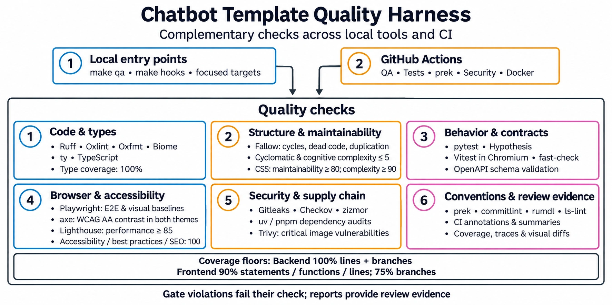

# Chatbot Template

A minimal full-stack chatbot with a React frontend and FastAPI backend,
streaming replies from Azure OpenAI GPT-6 Astra and GPT-5.6 Sol deployments.

- Light and dark themes, responsive layouts, and keyboard controls.
- Model and reasoning choices, streamed responses, stop, regenerate, and copy.
- Syntax-highlighted code and LaTeX equations in Markdown replies.

## Architecture


The browser sends messages, model, and reasoning effort to `/api/v1/chat`
through the same-origin Vite or nginx proxy. FastAPI validates and rate-limits
requests, adds formatting instructions, and calls Azure OpenAI with server-side
credentials. Text deltas return through the proxy as a plain-text stream for
the React interface to render as Markdown, highlighted code, and LaTeX.

See [request routing](docs/getting-started.md#request-routing) and the
[backend API](docs/backend.md#api) for configuration and the request contract.

## See it in action

A local conversation turns projectile-motion equations into a typed Python
function, showing LaTeX and syntax highlighting in dark and light mode.

<!-- GitHub needs a bare attachment URL to render the video player. -->
<!-- rumdl-disable-next-line MD034 -->
https://github.com/user-attachments/assets/e12a4e90-5ed6-48d3-ad84-51b56a604dba

[Demo transcript and recording notes](docs/demo.md) ·
[Interface screenshots](docs/frontend.md#interface)

## Quick start

Install the [prerequisites](docs/getting-started.md#prerequisites), then run:

```bash
make setup
```

Set your Azure endpoint, API key, and API version in `backend/.env`.
The resource needs `gpt-6-astra` and `gpt-5.6-sol` deployments.

```bash
make service
```

Open [localhost:3000/chat](http://localhost:3000/chat). Press Ctrl+C to stop.

| Run           | Command                         |
| ------------- | ------------------------------- |
| Both services | `make service`                  |
| Backend only  | `make service SERVICE=backend`  |
| Frontend only | `make service SERVICE=frontend` |

See [getting started](docs/getting-started.md) for configuration and Docker,
and [security](docs/security.md) before deployment.

## Quality harness



`make qa`, prek hooks, and GitHub Actions check code and architectural quality.
Fallow rejects dependency cycles, dead code, duplication, and complexity
violations. Tests, coverage floors, type coverage, CSS quality, accessibility,
and security scans provide complementary checks and review evidence.

The diagram uses blue, orange, and purple accents with numbered groups and dark
text on white; its meaning does not depend on distinguishing colors.
See [development](docs/development.md#quality-harness) for the gates and
thresholds, and [security scans](docs/security.md#automated-scans) for scan scope.

## Documentation

| Guide                                      | What you will find                                      |
| ------------------------------------------ | ------------------------------------------------------- |
| [Getting started](docs/getting-started.md) | Setup, configuration, local development, Docker         |
| [Frontend](docs/frontend.md)               | Interface, Markdown rendering, accessibility            |
| [Backend](docs/backend.md)                 | Configuration, API, streaming, validation               |
| [Development](docs/development.md)         | Commands, testing, coverage, naming, hooks, CI          |
| [Security](docs/security.md)               | Credentials, deployment boundaries, supply chain, scans |

Run `make qa` for local quality checks and `make hooks` for all pre-commit hooks.
Agent-specific instructions live in [AGENTS.md](AGENTS.md).
