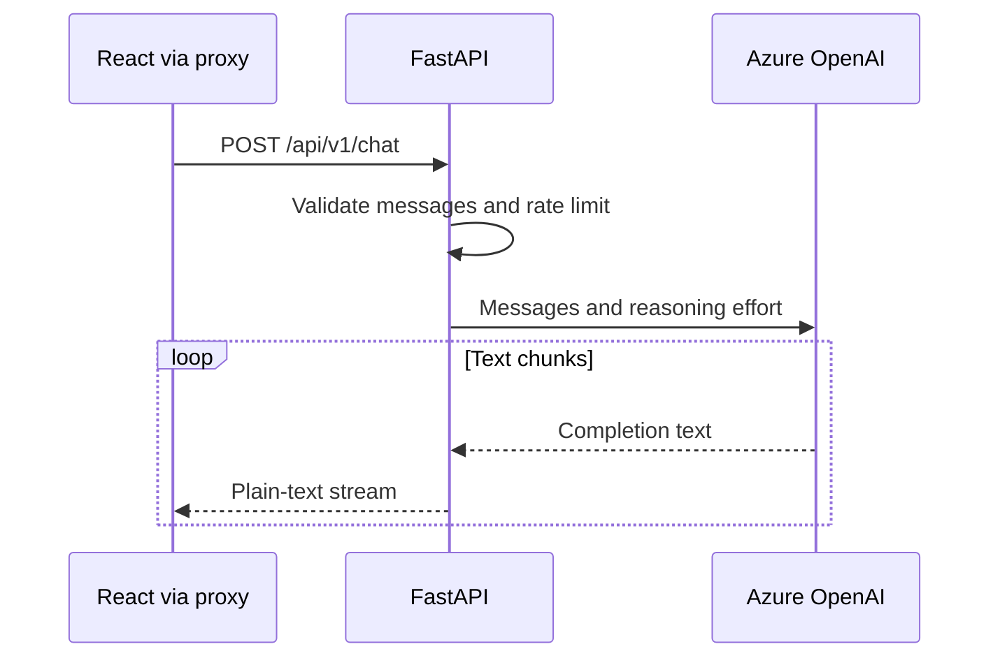

# Backend

[Documentation](README.md) · [Project overview](../README.md)

FastAPI validates requests and streams Azure OpenAI text to the frontend.
Run it with `make service SERVICE=backend`; see [getting started](getting-started.md).



## Source map

| File                                                  | Responsibility                                                                 |
| ----------------------------------------------------- | ------------------------------------------------------------------------------ |
| [main.py](../backend/app/main.py)                     | FastAPI routes, request validation, CORS, rate limiting, Markdown instructions |
| [azure_client.py](../backend/app/azure_client.py)     | Cached Azure client, streaming completions, logging                            |
| [stream_metrics.py](../backend/app/stream_metrics.py) | Per-completion timing, provider usage, and structured metrics                  |
| [config.py](../backend/app/config.py)                 | Environment settings and startup validation                                    |
| [entities.py](../backend/app/entities.py)             | Model, reasoning effort, and message role enums                                |
| [tests](../backend/tests)                             | Unit, property-based, and snapshot tests; the Azure transport double           |

## Configuration

Settings read environment variables and `backend/.env` when started from the
backend directory. Azure values must be nonempty unless `TESTING=true`.

| Variable                   | Meaning / default                                                                |
| -------------------------- | -------------------------------------------------------------------------------- |
| `AZURE_OPENAI_ENDPOINT`    | Azure resource endpoint; required                                                |
| `AZURE_OPENAI_API_KEY`     | Azure resource key; required, server-side only                                   |
| `AZURE_OPENAI_API_VERSION` | Azure API version; the example uses `2024-09-01-preview`                         |
| `CORS_ALLOWED_ORIGINS`     | JSON list; defaults to `["http://localhost:3000"]`                               |
| `CHAT_RATE_LIMIT`          | Per-client-address chat limit; defaults to `10/minute`                           |
| `TESTING`                  | Defaults to `false`; permits missing credentials in tests, without mocking Azure |

- `DEBUG` and `ALLOWED_HOSTS` in the example file are not consumed; they do not
  enable debug mode or host filtering.
- Settings and the Azure client are cached: restart after configuration changes.

## API

| Endpoint            | Behavior                                                      |
| ------------------- | ------------------------------------------------------------- |
| `GET /health`       | Returns `{"status":"ok"}`; does not contact Azure             |
| `POST /api/v1/chat` | Streams the assistant response as `text/plain; charset=utf-8` |
| `GET /docs`         | Interactive Swagger UI                                        |
| `GET /openapi.json` | Generated OpenAPI schema                                      |

Example request body:

```json
{
  "messages": [{ "role": "user", "content": "Explain Python generators." }],
  "model": "gpt-6-astra",
  "reasoning_effort": "low"
}
```

The frontend's AI SDK messages can instead provide text parts:

```json
{
  "messages": [
    { "role": "user", "parts": [{ "type": "text", "text": "Explain gravity." }] }
  ]
}
```

| Request field                  | Contract                                                      |
| ------------------------------ | ------------------------------------------------------------- |
| Messages                       | 1–50 messages; roles: `system`, `user`, `assistant`           |
| Text parts                     | Up to 50 per message                                          |
| Text length                    | At most 32,000 characters per message, including joined parts |
| `content` and `parts` together | `content` takes precedence                                    |
| Whitespace-only messages       | Omitted; an entirely empty conversation returns HTTP 400      |
| Schema violations / rate limit | HTTP 422 / HTTP 429                                           |
| Model                          | `gpt-6-astra` (default), `gpt-5.6-sol`                        |
| Reasoning effort               | `low` (default), `medium`, `high`                             |

- Validate before starting the stream so invalid input retains its HTTP status.
- The server prepends formatting instructions for the [frontend renderer](frontend.md).
- `TextStreamChatTransport` consumes plain text; the response is not SSE or JSON.
- Azure errors are logged and re-raised. Once headers are sent, failures interrupt
  the stream rather than becoming a new JSON error response.

## Stream instrumentation

Run `make service SERVICE=backend` to see one `azure_openai_stream` metrics event
per consumed completion in the backend logs. The event contains JSON fields in
the default console output and the same dictionary under
`record["extra"]["stream_metrics"]` for Loguru sinks.

| Field                                                | Meaning                                                                                                     |
| ---------------------------------------------------- | ----------------------------------------------------------------------------------------------------------- |
| `model`, `reasoning_effort`                          | Requested deployment and reasoning effort                                                                   |
| `status`                                             | `completed`, `error`, or `interrupted`                                                                      |
| `ttft_ms`                                            | Milliseconds from the provider request starting to the first nonempty text delta; `null` if no text arrives |
| `duration_ms`                                        | Elapsed time until completion, failure, or generator closure                                                |
| `output_chars`                                       | Characters yielded to the caller; this is not a token count                                                 |
| `usage_received`                                     | Whether Azure reported token usage                                                                          |
| `prompt_tokens`, `completion_tokens`, `total_tokens` | Provider-reported counts for this request, or `null` when unavailable                                       |

- Timing uses a monotonic clock. TTFT includes provider connection, retries, and
  generation before the first text delta. Role-only, empty, and usage-only chunks
  do not start it. It measures backend receipt, not browser rendering latency.
- The request sets `stream_options={"include_usage": true}` and consumes the
  final usage chunk even though its choices are empty. Counts come from Azure;
  they are not estimated from text, missing usage is never reported as zero, and
  a zero-token report is never reported as missing.
  Prompt tokens cover the entire submitted conversation and server instructions;
  completion tokens can include reasoning tokens, not just visible reply text.
- Failures and generator closure retain the measurements available so far.
  `completed` means the provider iterator was exhausted, not that the browser
  received every byte. The synchronous streaming adapter does not guarantee
  immediate upstream cancellation or metrics emission when a browser disconnects.
- Metrics contain no message text, credentials, or user identifiers. They are
  per-request log events, not a persisted billing ledger or metrics endpoint.

Token usage stays in backend telemetry. The chat currently has no budget or
billing controls that would make counts actionable, and its plain-text transport
cannot carry final usage metadata. If budget controls are added, introduce a
typed metadata stream and optional per-reply usage details together; do not mix
metrics into assistant text or present token counts as a price estimate.

## Tests

Tests exercise the real `openai` SDK over a mock HTTP transport instead of
stubbing `chat.completions.create`, so the deployment URL, `api-version`, SSE
parsing, and status-to-exception mapping stay inside the system under test.

| Module                                                            | Scope                                                              |
| ----------------------------------------------------------------- | ------------------------------------------------------------------ |
| [azure_double.py](../backend/tests/azure_double.py)               | Transport double, SSE chunk builders, canned faults, request probe |
| [test_azure_client.py](../backend/tests/test_azure_client.py)     | Outbound request, streaming, and upstream error handling           |
| [test_stream_metrics.py](../backend/tests/test_stream_metrics.py) | `StreamMetrics` and `measure_stream` against a controllable clock  |
| [test_main.py](../backend/tests/test_main.py)                     | Endpoint behavior, request validation, rate limiting               |
| [test_config.py](../backend/tests/test_config.py)                 | Settings defaults and validators, including property tests         |

- Expected values are [inline snapshots](https://15r10nk.github.io/inline-snapshot/).
  Regenerate them with `make backend-snapshot-update` and review the diff; do not
  hand-edit snapshots or replace them with values the test recomputes itself.
  Snapshots inside `@pytest.mark.parametrize` are rewritten per case.
- Prefer asserting the recorded request and the emitted metrics event over
  asserting that a stub was called. Add faults to `azure_double.py` rather than
  patching the SDK internals.
- Client configuration is checked through `record_request`, which re-targets a
  built client at a mock transport and returns what reached the wire, so the
  assertions stay on the URL and headers rather than on SDK attributes.
- The double sets `max_retries=0`; the production client retries five times, so
  a simulated failure would otherwise spend seconds in backoff.
- Tests drive time through the `clock` fixture, never the real monotonic clock.
- To confirm a test earns its place, break the behavior it covers and check that
  it fails. `TESTING=true` keeps this offline: no test contacts Azure.

## Checks

| Task                        | Command / requirement                                                       |
| --------------------------- | --------------------------------------------------------------------------- |
| Backend QA                  | `make qa-backend`: naming, Ruff, ty, dependency audit, tests, type coverage |
| OpenAPI without credentials | `make backend-validate-api-schema`                                          |
| FastAPI and Locust          | `make backend-load-test`; chat requests consume Azure quota                 |
| Coverage                    | 100% lines, branches, and type annotations                                  |
| Shared policies             | [Development](development.md), [security](security.md)                      |
