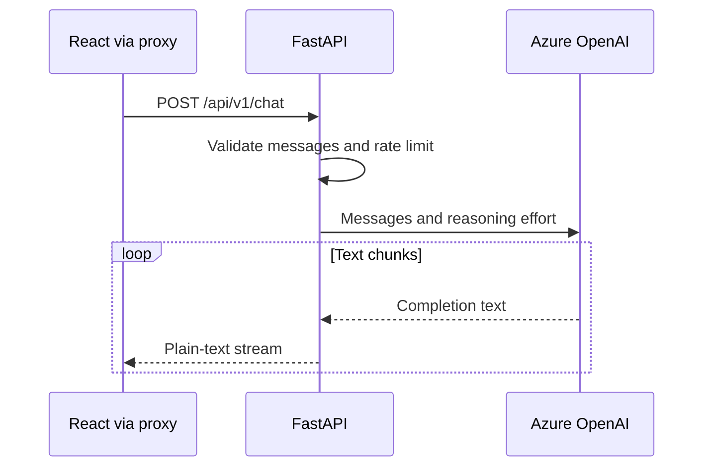

# Backend

[Documentation](README.md) · [Project overview](../README.md)

FastAPI validates requests and streams Azure OpenAI text to the frontend.
Run it with `make service SERVICE=backend`; see [getting started](getting-started.md).



## Source map

| File                                              | Responsibility                                                                 |
| ------------------------------------------------- | ------------------------------------------------------------------------------ |
| [main.py](../backend/app/main.py)                 | FastAPI routes, request validation, CORS, rate limiting, Markdown instructions |
| [azure_client.py](../backend/app/azure_client.py) | Cached Azure client, streaming completions, logging                            |
| [config.py](../backend/app/config.py)             | Environment settings and startup validation                                    |
| [entities.py](../backend/app/entities.py)         | Model, reasoning effort, and message role enums                                |
| [tests](../backend/tests)                         | Unit and property-based tests                                                  |

## Configuration

Settings read environment variables and `backend/.env` when started from the
backend directory. Azure values must be nonempty unless `TESTING=true`.

| Variable                   | Meaning / default                                                                |
| -------------------------- | -------------------------------------------------------------------------------- |
| `AZURE_OPENAI_ENDPOINT`    | Azure resource endpoint; required                                                |
| `AZURE_OPENAI_API_KEY`     | Azure resource key; required, server-side only                                   |
| `AZURE_OPENAI_API_VERSION` | Azure API version; the example uses `2024-09-01-preview`                         |
| `CORS_ALLOWED_ORIGINS`     | JSON list; defaults to `["http://localhost:3000"]`                               |
| `CHAT_RATE_LIMIT`          | Per-client-address chat limit; defaults to `10/minute`                           |
| `TESTING`                  | Defaults to `false`; permits missing credentials in tests, without mocking Azure |

- `DEBUG` and `ALLOWED_HOSTS` in the example file are not consumed; they do not
  enable debug mode or host filtering.
- Settings and the Azure client are cached: restart after configuration changes.

## API

| Endpoint            | Behavior                                                      |
| ------------------- | ------------------------------------------------------------- |
| `GET /health`       | Returns `{"status":"ok"}`; does not contact Azure             |
| `POST /api/v1/chat` | Streams the assistant response as `text/plain; charset=utf-8` |
| `GET /docs`         | Interactive Swagger UI                                        |
| `GET /openapi.json` | Generated OpenAPI schema                                      |

Example request body:

```json
{
  "messages": [{ "role": "user", "content": "Explain Python generators." }],
  "model": "gpt-6-astra",
  "reasoning_effort": "low"
}
```

The frontend's AI SDK messages can instead provide text parts:

```json
{
  "messages": [
    { "role": "user", "parts": [{ "type": "text", "text": "Explain gravity." }] }
  ]
}
```

| Request field                  | Contract                                                      |
| ------------------------------ | ------------------------------------------------------------- |
| Messages                       | 1–50 messages; roles: `system`, `user`, `assistant`           |
| Text parts                     | Up to 50 per message                                          |
| Text length                    | At most 32,000 characters per message, including joined parts |
| `content` and `parts` together | `content` takes precedence                                    |
| Whitespace-only messages       | Omitted; an entirely empty conversation returns HTTP 400      |
| Schema violations / rate limit | HTTP 422 / HTTP 429                                           |
| Model                          | `gpt-6-astra` (default), `gpt-5.6-sol`                        |
| Reasoning effort               | `low` (default), `medium`, `high`                             |

- Validate before starting the stream so invalid input retains its HTTP status.
- The server prepends formatting instructions for the [frontend renderer](frontend.md).
- `TextStreamChatTransport` consumes plain text; the response is not SSE or JSON.
- Azure errors are logged and re-raised. Once headers are sent, failures interrupt
  the stream rather than becoming a new JSON error response.

## Checks

| Task                        | Command / requirement                                                       |
| --------------------------- | --------------------------------------------------------------------------- |
| Backend QA                  | `make qa-backend`: naming, Ruff, ty, dependency audit, tests, type coverage |
| OpenAPI without credentials | `make backend-validate-api-schema`                                          |
| FastAPI and Locust          | `make backend-load-test`; chat requests consume Azure quota                 |
| Coverage                    | 100% lines, branches, and type annotations                                  |
| Shared policies             | [Development](development.md), [security](security.md)                      |
