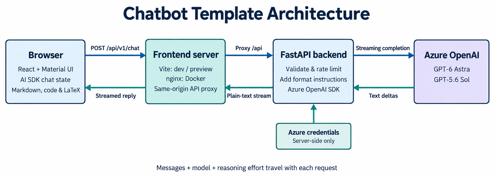

# Backend

[Documentation](README.md) · [Project overview](../README.md)

FastAPI validates requests and streams Azure OpenAI text to the frontend.
Run it with `make service SERVICE=backend`; see [getting started](getting-started.md).

For `POST /api/v1/chat`, FastAPI validates messages and enforces the rate limit
before streaming starts. It adds formatting instructions and forwards the
messages, model, and reasoning effort to Azure OpenAI. Completion text streams
back through the frontend proxy as plain text.

## Source map

| File                                                  | Responsibility                                                                 |
| ----------------------------------------------------- | ------------------------------------------------------------------------------ |
| [main.py](../backend/app/main.py)                     | FastAPI routes, request validation, CORS, rate limiting, Markdown instructions |
| [azure_client.py](../backend/app/azure_client.py)     | Cached Azure client, streaming completions, logging                            |
| [stream_metrics.py](../backend/app/stream_metrics.py) | Per-completion timing, provider usage, and structured metrics                  |
| [config.py](../backend/app/config.py)                 | Environment settings and startup validation                                    |
| [entities.py](../backend/app/entities.py)             | Model, reasoning effort, and message role enums                                |
| [tests](../backend/tests)                             | Unit, property-based, and snapshot tests; the Azure transport double           |

## Configuration

Settings read environment variables and `backend/.env` when started from the
backend directory. Azure values must be nonempty unless `TESTING=true`.

| Variable                   | Meaning / default                                                                |
| -------------------------- | -------------------------------------------------------------------------------- |
| `AZURE_OPENAI_ENDPOINT`    | Azure resource endpoint; required                                                |
| `AZURE_OPENAI_API_KEY`     | Azure resource key; required, server-side only                                   |
| `AZURE_OPENAI_API_VERSION` | Azure API version; the example uses `2024-09-01-preview`                         |
| `CORS_ALLOWED_ORIGINS`     | JSON list; defaults to `["http://localhost:3000"]`                               |
| `CHAT_RATE_LIMIT`          | Per-client-address chat limit; defaults to `10/minute`                           |
| `TESTING`                  | Defaults to `false`; permits missing credentials in tests, without mocking Azure |

- `DEBUG` and `ALLOWED_HOSTS` in the example file are not consumed; they do not
  enable debug mode or host filtering.
- Settings and the Azure client are cached: restart after configuration changes.

## API

FastAPI automatically generates the OpenAPI schema and an interactive Swagger UI
from the endpoint functions and Pydantic models. Visit
`http://localhost:8000/docs` while the backend is running to explore the
endpoints and request schemas.

Note these runtime constraints which are not represented in the schema:

- A message must provide either `content` or `parts`; if both are provided,
  `content` takes precedence.
- The joined text of all parts cannot exceed 32,000 characters.
- Messages that are entirely whitespace are dropped. If the resulting
  conversation is empty, the server returns HTTP 400.
- Exceeding the rate limit returns HTTP 429.
- Validate before starting the stream so invalid input retains its HTTP status.
- The server prepends formatting instructions for the [frontend renderer](frontend.md).
- `TextStreamChatTransport` consumes plain text; the response is not SSE or JSON.
- Azure errors are logged and re-raised. Once headers are sent, failures interrupt
  the stream rather than becoming a new JSON error response.

## Stream instrumentation

Run `make service SERVICE=backend` to see one `azure_openai_stream` metrics event
per consumed completion in the backend logs. The event contains JSON fields in
the default console output and the same dictionary under
`record["extra"]["stream_metrics"]` for Loguru sinks.

| Field                                                | Meaning                                                                                                     |
| ---------------------------------------------------- | ----------------------------------------------------------------------------------------------------------- |
| `model`, `reasoning_effort`                          | Requested deployment and reasoning effort                                                                   |
| `status`                                             | `completed`, `error`, or `interrupted`                                                                      |
| `ttft_ms`                                            | Milliseconds from the provider request starting to the first nonempty text delta; `null` if no text arrives |
| `duration_ms`                                        | Elapsed time until completion, failure, or generator closure                                                |
| `output_chars`                                       | Characters yielded to the caller; this is not a token count                                                 |
| `usage_received`                                     | Whether Azure reported token usage                                                                          |
| `prompt_tokens`, `completion_tokens`, `total_tokens` | Provider-reported counts for this request, or `null` when unavailable                                       |

- Timing uses a monotonic clock. TTFT includes provider connection, retries, and
  generation before the first text delta. Role-only, empty, and usage-only chunks
  do not start it. It measures backend receipt, not browser rendering latency.
- The request sets `stream_options={"include_usage": true}` and consumes the
  final usage chunk even though its choices are empty. Counts come from Azure;
  they are not estimated from text, missing usage is never reported as zero, and
  a zero-token report is never reported as missing.
  Prompt tokens cover the entire submitted conversation and server instructions;
  completion tokens can include reasoning tokens, not just visible reply text.
- Failures and generator closure retain the measurements available so far.
  `completed` means the provider iterator was exhausted, not that the browser
  received every byte. The synchronous streaming adapter does not guarantee
  immediate upstream cancellation or metrics emission when a browser disconnects.
- Metrics contain no message text, credentials, or user identifiers. They are
  per-request log events, not a persisted billing ledger or metrics endpoint.

Token usage stays in backend telemetry. The chat currently has no budget or
billing controls that would make counts actionable, and its plain-text transport
cannot carry final usage metadata. If budget controls are added, introduce a
typed metadata stream and optional per-reply usage details together; do not mix
metrics into assistant text or present token counts as a price estimate.

## OpenTelemetry

FastAPI's [native OpenTelemetry support](https://fastapi.tiangolo.com/advanced/opentelemetry/)
is on by default and needs no application code. It exports nothing until an OTLP
endpoint is set. It reads process environment variables, not the settings loader;
`make service` and Docker Compose both load `backend/.env` into the process, and
variables exported in the shell take precedence under `make service`.

| Variable                      | Meaning                                                                |
| ----------------------------- | ---------------------------------------------------------------------- |
| `OTEL_SERVICE_NAME`           | Service name on exported signals; defaults to `unknown_service:python` |
| `OTEL_EXPORTER_OTLP_ENDPOINT` | Collector's OTLP HTTP/protobuf base URL, e.g. `http://localhost:4318`  |
| `OTEL_EXPORTER_OTLP_HEADERS`  | Collector authentication headers, when required                        |

- Each request gets a server span named after its route, with child spans for
  dependency resolution, the endpoint, and serialization. The chat span stays
  open until the last streamed byte, so its duration covers the whole reply.
- Metrics are `http.server.request.duration` and `http.server.active_requests`.
- Log records cover request validation failures and unhandled exceptions. A
  failure mid-stream sets `error.type` on the span even though the status is 200.
- These signals are HTTP-level only. TTFT and token usage remain in the
  `azure_openai_stream` log event above and are not exported.
- Unsupported exporter settings, such as `OTEL_TRACES_EXPORTER=console`, log a
  warning and leave the server running without export.

## Tests

Tests exercise the real `openai` SDK over a mock HTTP transport instead of
stubbing `chat.completions.create`, so the deployment URL, `api-version`, SSE
parsing, and status-to-exception mapping stay inside the system under test.

| Module                                                        | Scope                                                                 |
| ------------------------------------------------------------- | --------------------------------------------------------------------- |
| [azure_double.py](../backend/tests/azure_double.py)           | Transport double, SSE chunk builders, canned faults, request probe    |
| [test_azure_client.py](../backend/tests/test_azure_client.py) | Outbound request, streaming, upstream errors, and the metrics event   |
| [test_main.py](../backend/tests/test_main.py)                 | Endpoint behavior, request validation, rate limiting                  |
| [test_config.py](../backend/tests/test_config.py)             | Settings defaults and validators, including property tests            |

- Expected values are [inline snapshots](https://15r10nk.github.io/inline-snapshot/).
  Regenerate them with `make backend-snapshot-update` and review the diff; do not
  hand-edit snapshots or replace them with values the test recomputes itself.
  Snapshots inside `@pytest.mark.parametrize` are rewritten per case.
- Prefer asserting the recorded request and the emitted metrics event over
  asserting that a stub was called. Add faults to `azure_double.py` rather than
  patching the SDK internals.
- SSE fixtures are built as real `ChatCompletionChunk` models and serialized with
  the SDK's own `to_json`, so a fixture that the SDK could never emit fails to
  construct rather than silently exercising a shape production never sees.
- Client configuration is checked through `record_request`, which re-targets a
  built client at a mock transport and returns what reached the wire, so the
  assertions stay on the URL and headers rather than on SDK attributes.
- The double sets `max_retries=0`; the production client retries five times, so
  a simulated failure would otherwise spend seconds in backoff.
- Tests drive time through the `clock` fixture, never the real monotonic clock.
- To confirm a test earns its place, break the behavior it covers and check that
  it fails. `TESTING=true` keeps this offline: no test contacts Azure.

## Checks

| Task                        | Command / requirement                                                       |
| --------------------------- | --------------------------------------------------------------------------- |
| Backend QA                  | `make qa-backend`: naming, Ruff, ty, dependency audit, tests, type coverage |
| OpenAPI without credentials | `make backend-validate-api-schema`                                          |
| FastAPI and Locust          | `make backend-load-test`; chat requests consume Azure quota                 |
| Coverage                    | 100% lines, branches, and type annotations                                  |
| Shared policies             | [Development](development.md), [security](security.md)                      |
