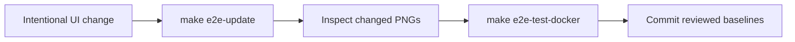

# Development and quality assurance

[Documentation](README.md) · [Project overview](../README.md)

## Command reference

Run commands from the repository root. Start with `make setup` and `make service`;
see [getting started](getting-started.md) for service selection and configuration.

| Command                                      | Purpose                                                         |
| -------------------------------------------- | --------------------------------------------------------------- |
| `make qa`                                    | Format, lint, types, schema, coverage, frontend audits, Checkov |
| `make qa-backend` / `make qa-frontend`       | Checks for one service, including its dependency audit          |
| `make format` / `make lint`                  | Formatting / ls-lint, Ruff, Biome, rumdl                        |
| `make type-check` / `make type-coverage`     | Static types / 100% type coverage                               |
| `make test`                                  | Backend and frontend unit tests with coverage                   |
| `make backend-validate-api-schema`           | Generate and validate OpenAPI without credentials               |
| `make backend-load-test`                     | Start the backend and Locust against it                         |
| `make fallow` / `make css-quality`           | Frontend codebase / CSS analysis                                |
| `make contrast-audit` / `make lighthouse`    | Build and audit the frontend                                    |
| `make e2e-test` / `make e2e-test-docker`     | Local browser behavior / pinned visual renderer                 |
| `make e2e-update`                            | Regenerate visual baselines for review                          |
| `make file-naming` / `make markdown-lint`    | Repository naming / Markdown checks                             |
| `make hooks`                                 | All pre-commit hooks across tracked files                       |
| `make update-deps`                           | Refresh dependencies, package revisions, and hook pins          |
| `make security-scan` / `make secret-scan-ci` | Checkov / full-history Gitleaks with Docker                     |
| `make docker-build`                          | Build both service images                                       |
| `make setup` / `make service`                | Restore dependencies / run selected development services        |
| `make frontend-preview`                      | Build and preview the frontend                                  |
| `make docker-up` / `make docker-down`        | Build/start / stop Compose services                             |
| `make markdown-format`                       | Format Markdown and align tables                                |
| `make clean`                                 | Remove generated output and local / unused shared caches        |

Targets live in [Makefile](../Makefile), [backend.mk](../makefiles/backend.mk), and
[frontend.mk](../makefiles/frontend.mk). `make format` includes Markdown formatting;
rumdl enforces aligned table columns in lint, QA, and hooks.

## Cleaning and rebuilding

Stop development servers and test runs, then run:

```bash
make clean
make setup
make qa
```

| Removed by `make clean`                                                 | Recreated by                                 |
| ----------------------------------------------------------------------- | -------------------------------------------- |
| Backend `.venv`, frontend and root `node_modules`                       | `make setup`                                 |
| Python bytecode, pytest / Hypothesis caches, coverage data and XML      | `make backend-test`                          |
| Ruff, rumdl, Fallow, TypeScript, ESLint, and local `.cache` directories | `make qa`                                    |
| Frontend build and coverage output                                      | `make frontend-build` / `make frontend-test` |
| Playwright reports, traces, blob reports, and local cache               | `make e2e-test` / `make e2e-test-docker`     |
| Lighthouse reports                                                      | `make lighthouse`                            |
| Gitleaks `results.sarif`                                                | `make secret-scan-ci`                        |
| uv download/tool cache; unused pnpm packages, metadata and dlx cache    | `make setup` and the relevant tool targets   |
| Local pnpm stores and Docker's `chatbot-pw-*` dependency volumes        | `make setup` / `make e2e-test-docker`        |

- `backend/.env`, source files, lockfiles, and visual baselines are preserved.
- uv and pnpm caches are shared with other projects: their next runs may download
  packages again. pnpm pruning preserves packages still referenced by other
  projects, so it does not guarantee a completely empty shared store.
- Docker cleanup removes only `chatbot-pw-node-modules` and the legacy
  `chatbot-pw-pnpm-store` volume. If Docker is unavailable, cleanup reports the
  skip; rerun `make docker-clean` after starting it. In-use volumes fail cleanup.
- Installed runtimes, browser binaries, hook environments, Docker images, and
  shared Docker build layers remain. `make docker-build` already uses `--no-cache`
  to rebuild service layers; `make e2e-test-docker` repopulates its dependency volume.
- `make backend-clean` / `make frontend-clean` remove only that service's local
  artifacts. `make cache-clean` separately repeats shared package-cache cleanup.

## Automated checks

| Gate                     | Required threshold / behavior                                                                                          |
| ------------------------ | ---------------------------------------------------------------------------------------------------------------------- |
| Backend coverage         | 100% lines and branches                                                                                                |
| Frontend coverage        | ≥90% statements/functions/lines; ≥75% branches                                                                         |
| Type annotation coverage | 100% on both sides                                                                                                     |
| Lighthouse               | Three mobile-throttled samples; assert the median                                                                      |
| Lighthouse failures      | Performance, accessibility, best practices, SEO, LCP, CLS, TBT; no unresolved `runWarnings` or warn-only assertions    |
| Contrast                 | WCAG AA in both themes                                                                                                 |
| Manual UI review         | [Vercel Web Interface Guidelines](https://vercel.com/design/guidelines); automated checks do not prove full compliance |

| Step                     | Frontend                                           | Backend      |
| ------------------------ | -------------------------------------------------- | ------------ |
| Package manager          | pnpm                                               | uv           |
| Formatter                | Biome                                              | Ruff         |
| Linter                   | Biome                                              | Ruff         |
| Import sorter            | Biome                                              | Ruff         |
| Type checker             | TypeScript                                         | ty           |
| Type annotation coverage | type-coverage                                      | typecoverage |
| Security linting         | ESLint (`no-unsanitized`, `react-dom`)             | \-           |
| Codebase analysis        | Fallow                                             | \-           |
| CSS code quality         | @projectwallace/css-code-quality                   | \-           |
| Contrast audit           | axe-core (`color-contrast`) in light and dark mode | \-           |
| Markdown linting         | rumdl                                              | rumdl        |
| File naming              | ls-lint                                            | ls-lint      |
| Pre-commit hooks         | prek                                               | prek         |
| Commit message linting   | commitlint                                         | commitlint   |
| IaC / workflow scan      | Checkov                                            | Checkov      |
| Secret scanning          | Gitleaks                                           | Gitleaks     |
| GitHub Actions audit     | zizmor                                             | zizmor       |
| Container vuln scan      | Trivy                                              | Trivy        |
| Unit testing             | Vitest                                             | pytest       |
| Property-based testing   | fast-check                                         | Hypothesis   |
| Code coverage            | Vitest                                             | coverage.py  |
| Coverage floor           | 90% statements/functions/lines; 75% branches       | 100%         |
| Load testing             | \-                                                 | locust       |
| End-to-end testing       | Playwright                                         | \-           |
| Dependency audit         | pnpm audit                                         | uv audit     |
| Performance / a11y       | Lighthouse CI, axe-core                            | \-           |
| API client               | Vercel AI SDK                                      | openai       |
| API server               | \-                                                 | FastAPI      |
| UI toolkit               | Material UI                                        | \-           |
| Logger                   | \-                                                 | loguru       |

## Browser and visual tests

| Layer                     | Purpose                                                                             |
| ------------------------- | ----------------------------------------------------------------------------------- |
| Vitest                    | Data contracts, interactions, unit coverage                                         |
| Playwright                | Real app at desktop/mobile sizes, light/dark themes; API responses mocked           |
| Local browser tests       | `make e2e-test`; visual comparisons skip off Linux                                  |
| Canonical visual renderer | `make e2e-test-docker`; digest-pinned Linux/amd64 image, including on Apple Silicon |
| Baseline updates          | `make e2e-update`; review every changed PNG                                         |



- The container uses a dedicated dependency volume and restores host UID/GID
  ownership of generated files, including after failures.
- Production preview requires port 3000 to be free; it never reuses a server.
- Snapshots cover greeting, validation, model/reasoning menus, Markdown replies,
  pending responses, and request failures.
- Assertions wait for bundled fonts and stable rendering with animations disabled.
  Ordinary runs fail on missing baselines and never update them automatically.
- `make qa` / `make qa-frontend` retain unit coverage; the separate browser CI job
  runs `make e2e-test-docker`.
- When upgrading Playwright, update the image tag and SHA256 digest in
  `makefiles/frontend.mk` together, then regenerate and review baselines.

| Artifact / option        | Location / usage                                                                         |
| ------------------------ | ---------------------------------------------------------------------------------------- |
| Baselines                | `frontend/e2e-tests/__snapshots__/`                                                      |
| Failure diffs and traces | `frontend/test-results/`                                                                 |
| HTML report              | `frontend/playwright-report/`; CI uploads both report directories as `playwright-report` |
| Focus a Docker run       | Append `E2E_ARGS='visual.spec.ts --workers=1'`                                           |

## Frontend code quality with Fallow

[Fallow](https://docs.fallow.tools/) complements Biome, ESLint, TypeScript, and
unit tests. Its [configuration](../frontend/.fallowrc.json) uses the installed
package schema to match the lockfile.

| Analysis                 | Policy                                                                                                      |
| ------------------------ | ----------------------------------------------------------------------------------------------------------- |
| Dead code / dependencies | All configured rules are errors, including unresolved imports, unused exports/types/packages, and cycles    |
| Duplication              | Strict mode; minimum 50 tokens and 4 lines; built-in generated/test/mock exclusions retained                |
| Complexity               | Cyclomatic and cognitive complexity each ≤5, including application code, scripts, and tests                 |
| Execution                | `doctor` first, then all analyses with `--fail-on-issues`; standalone `make fallow`, also in both QA suites |
| CSS                      | Separate CSS quality and contrast gates                                                                     |

- Keep `src/main.tsx` as the runtime entry; discover package scripts and test/tool
  entry points through built-in plugins. Do not add QA scripts as runtime entries.
- Limit dependency exceptions to `@emotion/react`, `@emotion/styled` (MUI peers),
  and `babel-plugin-react-compiler` (loaded by `reactCompilerPreset()`).
- Recheck exceptions after upgrades. Directly imported QA packages and deleted
  mock paths need no exemptions.
- No blanket test exclusions or disabling unresolved-import checks.

## CI output

Keep every check and threshold intact when changing reporting.

| Report                  | Required behavior                                                                                          |
| ----------------------- | ---------------------------------------------------------------------------------------------------------- |
| QA workflow             | Separate steps for the same `make qa` gates                                                                |
| Fallow                  | `doctor`, GitHub annotations, compact job summary; retain `--fail-on-issues --quiet --summary` enforcement |
| Local Fallow            | Full report; health scores and template statistics remain advisory                                         |
| CSS quality             | Distinguish advisory scores; show penalty details on enforced failures                                     |
| Dependency installation | Retain warnings and errors                                                                                 |
| Build / Lighthouse      | Collapsible measurement details                                                                            |
| Tests                   | Compact progress plus failure diagnostics, annotations, coverage/HTML artifacts                            |
| Docker                  | Pass color variables explicitly; mirror the repository layout so annotations retain `frontend/` paths      |

Never rely on CI reporter exit codes alone.

| Color control | Setting / flag                  |
| ------------- | ------------------------------- |
| General       | `FORCE_COLOR`, `CLICOLOR_FORCE` |
| uv / prek     | `UV_COLOR`, `PREK_COLOR`        |
| Biome         | `--colors=force`                |
| zizmor        | `--color=always`                |
| pytest        | `--color=yes`                   |

## File naming

[ls-lint 2.3.1](https://ls-lint.org/2.3/configuration/the-basics.html) enforces
[.ls-lint.yml](../.ls-lint.yml). Directory overrides replace inherited rules.

| Layer                                                     | Convention                            | Example                                          |
| --------------------------------------------------------- | ------------------------------------- | ------------------------------------------------ |
| Python modules and tests                                  | snake_case; `__init__.py` allowed     | `azure_client.py`, `test_main.py`                |
| Python package directories                                | snake_case                            | `backend/app/`                                   |
| React components and page components                      | PascalCase, including colocated tests | `ChatInput.tsx`, `Page.test.tsx`                 |
| Client modules, hooks, and test helpers                   | camelCase, including test suffixes    | `useChatSetup.ts`, `testUtils.tsx`               |
| Vite entry point                                          | `main.tsx`                            | `frontend/src/main.tsx`                          |
| Frontend directories, CSS, fonts, and images              | kebab-case                            | `e2e-tests/`, `geist-mono-vf.woff`               |
| End-to-end tests and JavaScript utility scripts           | kebab-case                            | `chat-page.spec.ts`, `contrast-audit.mjs`        |
| Shell scripts, Make fragments, docs, and config basenames | kebab-case                            | `post-create.sh`, `backend.mk`, `update-deps.md` |

- Preserve standard names: `README.md`, `AGENTS.md`, `Dockerfile`, tool dotfiles.
- Compound extensions have explicit rules: `.test.tsx`, `.spec.ts`, `.config.ts`,
  `.d.ts`.
- Dependencies, generated reports/snapshots, and vendored agent skills are
  excluded; source assets remain checked.
- Naming runs across the whole repository in `make lint`, all QA suites, and the
  pre-commit hook, including when only naming rules change.

| Hook task            | Command / requirement                                                                                                                                                               |
| -------------------- | ----------------------------------------------------------------------------------------------------------------------------------------------------------------------------------- |
| Install hooks        | `prek install`                                                                                                                                                                      |
| Naming only          | `make file-naming` or `prek run ls-lint --all-files`                                                                                                                                |
| All pre-commit hooks | `make hooks`                                                                                                                                                                        |
| PATH                 | Both `make` and `ls-lint` must be available                                                                                                                                         |
| Installing ls-lint   | Devcontainer and QA/prek CI use checksum-verified 2.3.1; elsewhere follow the [versioned instructions](https://ls-lint.org/2.3/getting-started/installation.html) and verify SHA256 |
| Commit messages      | Conventional commits; lowercase or uppercase types accepted (`feat`, `FEAT`)                                                                                                        |

## Maintenance constraints

- `make update-deps` refreshes dependencies and frozen hook pins;
  it also adopts registry revisions of already locked package versions.
- Keep every coverage and quality threshold intact; do not lower gates to pass.
- Retain the upstream `ty-pre-commit` hook at a full commit SHA.
  If its bundled uv conflicts, downgrade the project uv pin.
  Synchronize Docker, installer checksum, and documentation.
  Do not substitute a local hook.
- prek CI uses cached hook environments and the upstream hook's uv, with no
  separate uv setup. prek 0.4.11 is the newest version covered by prek-action
  v3.0.0's SHA256 table; CI runs pre-commit, while local commit-msg and pre-push
  stages remain configured.
- Pin and SHA256-verify downloaded tools; see [security](security.md).
- Unless requested, do not wait for hosted CI after pushing; provide the PR or
  workflow link and distinguish local results from live checks.
