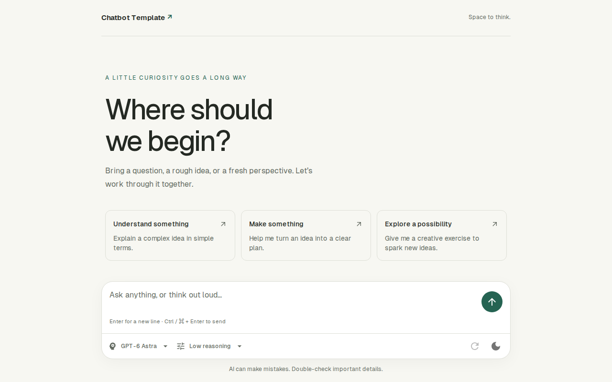
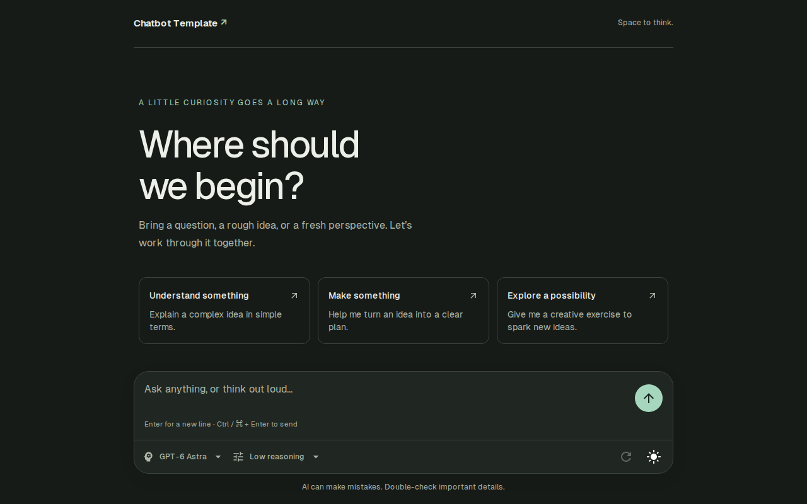

# Frontend

[Documentation](README.md) · [Project overview](../README.md)

React/Vite provides the interface; the Vercel AI SDK manages chat state and
streaming. See [request routing](getting-started.md#request-routing) and the
[backend contract](backend.md#api).

## Interface

| Light mode                                                           | Dark mode                                                          |
| -------------------------------------------------------------------- | ------------------------------------------------------------------ |
|  |  |

| Area                  | Behavior                                                                                                      |
| --------------------- | ------------------------------------------------------------------------------------------------------------- |
| Design                | [Material UI](https://mui.com/material-ui/getting-started/), local Geist fonts, responsive light/dark layouts |
| Interaction reference | [AI Elements](https://elements.ai-sdk.dev/), while retaining one UI toolkit                                   |
| Getting started       | Suggested prompts open a conversation                                                                         |
| Composer              | Model/reasoning choices, message validation, stop generation                                                  |
| Keyboard              | Enter inserts a line; Ctrl+Enter / Cmd+Enter sends                                                            |
| Scrolling             | Replies follow until the reader scrolls up; “Jump to latest” resumes following                                |
| Copy                  | Actions below replies preserve the original Markdown                                                          |

## Markdown and math

| Content                     | Renderer / behavior                                                                        |
| --------------------------- | ------------------------------------------------------------------------------------------ |
| Markdown                    | `react-markdown`; backend instructions request supported formatting                        |
| Code                        | `rehype-highlight` / highlight.js; syntax colors follow the theme                          |
| Languages                   | JavaScript, TypeScript, Python, SQL, CSS, and other common languages                       |
| Unknown / unlabelled fences | Readable plain code                                                                        |
| Math                        | `remark-math` + `rehype-katex`; [supported LaTeX subset](https://katex.org/docs/supported) |
| Incomplete / invalid math   | Remains readable during streaming; renders when valid                                      |
| Wide content                | Code and display equations scroll within the reply                                         |
| Safety                      | Raw HTML and trusted KaTeX commands disabled; fonts/styles bundled locally                 |

| Write                                          | Result                                    |
| ---------------------------------------------- | ----------------------------------------- |
| Language-tagged code fence, such as `python`   | Highlighted code; contents remain literal |
| `$E = mc^2$`                                   | Inline equation                           |
| `$$` on separate lines, or a `math` code fence | Display equation                          |
| `\(...\)` or `\[...\]`                         | Unsupported delimiters                    |
| `\$`                                           | Literal currency dollar sign              |

## Accessibility and web standards

Target: **WCAG 2.1 Level AA**. Use the
[Vercel Web Interface Guidelines](https://vercel.com/design/guidelines) when
reviewing new or changed UI; automated scores do not establish full compliance.

| Review     | Requirements                                                                                                               |
| ---------- | -------------------------------------------------------------------------------------------------------------------------- |
| Manual     | Keyboard operation, visible focus, loading/error states, reduced motion, resilient layout, semantic controls, concise copy |
| WCAG       | Check Perceivable, Operable, Understandable, and Robust criteria                                                           |
| Lighthouse | Accessibility, best practices, SEO: 100%; performance: ≥85%, all enforced                                                  |
| axe-core   | Every WCAG 2.0–2.2 A/AA rule and axe best practice, per UI state, theme, and layout; see below                             |

### Automated accessibility audit

`make accessibility-audit` (also part of `make qa` and CI) builds the frontend
and runs [axe-core](https://github.com/dequelabs/axe-core) through
`@axe-core/playwright` in
[`accessibility.spec.ts`](../frontend/e2e-tests/accessibility.spec.ts). Lighthouse
runs a subset of axe rules on the first render only, so this audit covers:

| Dimension | Coverage                                                                                                 |
| --------- | -------------------------------------------------------------------------------------------------------- |
| Rules     | Tags `wcag2a`, `wcag2aa`, `wcag21a`, `wcag21aa`, `wcag22aa`, `best-practice`                             |
| UI states | Initial, validation error, model and reasoning menus, Markdown conversation, pending reply, failed reply |
| Themes    | Light and dark                                                                                           |
| Layouts   | Desktop (1280×800) and mobile (390×844)                                                                  |

Any violation fails the gate with its rule, impact, and CSS targets. When UI
adds a state (a dialog, a new error, a new popup), add it to `STATES` in the
spec rather than relaxing a rule.

- MUI portals menus and tooltips outside every landmark. The audit counts
  `role="menu"` and `role="tooltip"` as regions; an open menu is modal, and a
  tooltip belongs to its control. This is the only rule option changed.
- Code blocks and display equations scroll horizontally, so a rehype step in
  `RichMarkdown.tsx` makes them focusable (`tabindex="0"`) with a visible focus
  outline, letting keyboard users scroll them.
- Theme colors must hold WCAG AA contrast in both modes, including error and
  disabled helper text; the dark palette overrides MUI's default error red.

Automated rules catch only part of WCAG; keep the manual review above.

[The Website Specification](https://specification.website/checklist/) also
informs the web foundations:

| Status                            | Scope                                                                                          |
| --------------------------------- | ---------------------------------------------------------------------------------------------- |
| Implemented                       | Document foundations, security headers, nginx caching/compression, PWA metadata                |
| Source files                      | `frontend/index.html`, `frontend/frontend.nginx.conf`, `frontend/app/favicon/site.webmanifest` |
| Out of scope for the internal SPA | Broader SEO, internationalization, agent-readiness categories                                  |
| Revisit on deployment changes     | HSTS at TLS termination; fonts as WOFF2                                                        |

## Working on the frontend

| Task                                 | Command / guidance                                                                                            |
| ------------------------------------ | ------------------------------------------------------------------------------------------------------------- |
| Development with hot reload          | `make service SERVICE=frontend`                                                                               |
| Build and preview production assets  | `make frontend-preview`                                                                                       |
| Frontend checks                      | `make qa-frontend`                                                                                            |
| Individual tools from `frontend/`    | `vp test`, `vp lint`, `vp fmt`, `vp check`, `vp run <script>`; see [tooling](development.md#automated-checks) |
| Proxy and Docker configuration       | [Getting started](getting-started.md)                                                                         |
| UI changes                           | [Browser and visual testing](development.md#browser-and-visual-tests)                                         |
| Analysis scope or dependency changes | [Fallow policy](development.md#frontend-code-quality-with-fallow)                                             |
