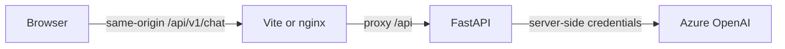

# Getting started

[Documentation](README.md) · [Project overview](../README.md)

## Prerequisites

Clone the repository and install the pinned tools, or use the development
container, which installs the toolchain for you.

| Runtime / tool | Current version | Source of truth                                                        |
| -------------- | --------------- | ---------------------------------------------------------------------- |
| Python         | 3.14            | `backend/.python-version`, `backend/pyproject.toml`                    |
| uv             | 0.12.12         | `backend/pyproject.toml`; Docker and installer pins must match         |
| Node.js        | 24              | `frontend/package.json`; `.nvmrc`, Docker, and devcontainer must match |
| pnpm           | 12.4.1          | `frontend/package.json`; CI reads this declaration                     |
| Make and Bash  | System tools    | Required by the development commands                                   |

- pnpm runs scripts with the declared Node.js runtime, even if the global version
  differs.
- Contributor hooks also need the pinned `ls-lint` binary on `PATH`; see
  [tooling requirements](development.md#file-naming).

## Setup and configuration

1. Run `make setup` from the repository root.
2. Set the Azure endpoint, API key, and API version in `backend/.env`.
3. Run `make service`, then open [the chatbot](http://localhost:3000/chat).

| Setup action          | Behavior                                                         |
| --------------------- | ---------------------------------------------------------------- |
| Environment file      | Copies `backend/.env.example` only when `backend/.env` is absent |
| Backend dependencies  | Restores the frozen uv lockfile                                  |
| Frontend dependencies | Restores the frozen pnpm lockfile                                |
| Repeated setup        | Preserves the existing environment file and credentials          |

| Azure choice     | Supported values                                               |
| ---------------- | -------------------------------------------------------------- |
| Deployment names | `gpt-6-astra`, `gpt-5.6-sol`                                   |
| Default model    | GPT-6 Astra                                                    |
| Reasoning effort | Low (default), medium, high                                    |
| Sampling option  | `reasoning_effort`; GPT-6 Astra does not support `temperature` |

See [backend configuration](backend.md#configuration) for settings. Credentials
stay in the backend; never commit `backend/.env`.

## Run services

| Task                        | Command                                       | Address                                           |
| --------------------------- | --------------------------------------------- | ------------------------------------------------- |
| Both services               | `make service` or `make service SERVICE=both` | Frontend and backend below                        |
| Backend only                | `make service SERVICE=backend`                | [localhost:8000](http://localhost:8000)           |
| Frontend only               | `make service SERVICE=frontend`               | [localhost:3000/chat](http://localhost:3000/chat) |
| API explorer                | Start the backend                             | [Swagger UI](http://localhost:8000/docs)          |
| Production frontend preview | `make frontend-preview`                       | [localhost:3000/chat](http://localhost:3000/chat) |

- Development servers support hot reload and bind to loopback by default.
- Logs remain in the terminal. Ctrl+C stops the selected services and reload
  workers; if either service exits in both-service mode, its sibling stops too.
- `make run` remains an alias for `make service`; `make run-backend` and
  `make run-frontend` also remain available, now in the foreground.
- Production preview builds first. It still needs a running backend for chat.

## Request routing

| Mode                        | Proxy target            | Configuration                                                             |
| --------------------------- | ----------------------- | ------------------------------------------------------------------------- |
| Local development / preview | `http://localhost:8000` | `frontend/vite.config.ts`                                                 |
| Custom local backend        | Your backend URL        | `CHAT_API_PROXY_TARGET=https://example.com make service SERVICE=frontend` |
| Docker Compose              | Backend container       | `frontend/frontend.nginx.conf`                                            |

## Docker Compose

| Task                            | Command             |
| ------------------------------- | ------------------- |
| Build and start both containers | `make docker-up`    |
| Stop both containers            | `make docker-down`  |
| Build images only               | `make docker-build` |

- Configure `backend/.env` first; Docker setup does not need host dependencies.
- Compose publishes frontend port 3000 and backend port 8000. Review
  [deployment security](security.md) before exposing either service.
- The frontend builder installs development dependencies; the final nginx image
  contains no `node_modules` or development tooling.
- [nginx configuration](../frontend/frontend.nginx.conf) controls proxying, SPA
  fallback, response headers, caching, and compression.

## Next steps

| Task                               | Guide / command                                        |
| ---------------------------------- | ------------------------------------------------------ |
| Understand the app                 | [Frontend](frontend.md), [backend](backend.md)         |
| Validate a change                  | `make qa`, then [development guidance](development.md) |
| Refresh dependencies and hook pins | `make update-deps`                                     |
| Format Markdown and align tables   | `make markdown-format`                                 |
